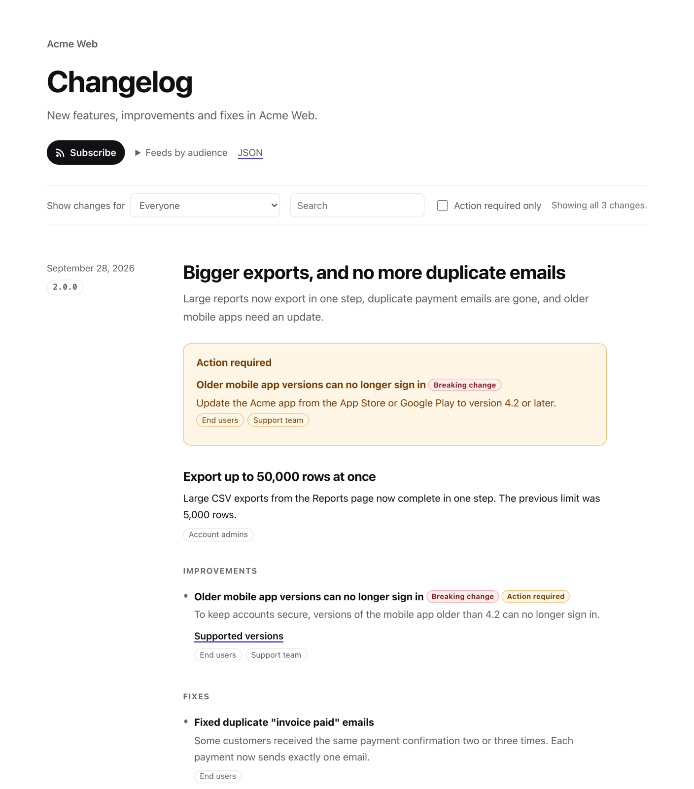

# Shiplog

**Changelogs people actually read.** Shiplog is a Claude Code skill that turns your git history into plain-language release notes. Every entry says **what changed, who is affected, and what they need to do**. It also publishes an accessible changelog page, Atom feeds (one per audience), a JSON feed and a `CHANGELOG.md`, for one app or a whole monorepo, and can announce each release in Slack.



## Why

Teams ship a lot, and most of it goes unnoticed. The changelog that does exist is usually written for engineers ("refactor auth middleware"). Support finds out about changes from customer tickets.

Shiplog makes impact a required part of every release:

- **What changed.** Plain language, from the reader's side.
- **Who is affected.** Audiences you define: admins, end users, API developers, support…
- **Action required.** Yes or no. If yes, the exact steps and a deadline.
- **Internal notes.** Talking points for support, kept off the public page.

Claude drafts the entries from your commits and PRs, asks about any impact it can't infer (all questions in one message), then validates and renders everything. A CI check blocks release tags that don't have a complete entry.

## Install

Shiplog works in any git repository: any language, with or without tags, one app or a monorepo.

**Into one repo, for the whole team.** Run this in the repo, then commit `.claude/skills/shiplog`. Everyone who opens the repo in Claude Code gets the skill:

```bash
curl -fsSL https://raw.githubusercontent.com/mrxvision97/shiplog/main/install.sh | sh
```

**For all your repos:**

```bash
curl -fsSL https://raw.githubusercontent.com/mrxvision97/shiplog/main/install.sh | sh -s -- --user
```

**Or as a Claude Code plugin:**

```
/plugin marketplace add mrxvision97/shiplog
/plugin install shiplog@shiplog
```

From a local clone, `sh install.sh` (or `sh install.sh --user`) does the same without downloading. Requires Python 3.10+ and git. There are no other dependencies.

### First run in an existing repo

Open Claude Code anywhere in the repo and say "Set up a changelog for this repo". Shiplog:

- detects the app name from `package.json`, `pyproject.toml`, `Cargo.toml`, `go.mod` or the git remote, and the tag style from existing tags (`v1.2.3`, `1.2.3`, `release-1.2.3`)
- keeps your existing `CHANGELOG.md`: each new release is added above the newest one **in the file's own format** (Keep a Changelog, conventional-changelog, or your own headings, dates and bullets), and existing entries are never changed
- with no tags yet, asks where the first release starts instead of summarizing years of history
- warns when you're on a feature branch, since releases come from `main`

## Use

In Claude Code, inside your repo:

> "Set up a changelog for this repo."
> "We're releasing today. Write the changelog."
> "Draft release notes for everything since v2.3.0."
> "What shipped in the api app since its last tag? Support needs a summary."

Claude will:

1. Create `.shiplog.json` and ask who your audiences are (first run only).
2. Collect changes since the last tag, grouped by pull request, and suggest a SemVer version.
3. Draft user-facing entries, skipping internal noise, and ask everything it can't infer in one batched message.
4. Write `.changelog/<app>/<version>.json`, the source of truth.
5. Validate and render in one step: `changelog/<app>/index.html` (plus yearly archive pages), `feed.xml`, `feed-<audience>.xml`, `changelog.json` and `CHANGELOG.md`.
6. Offer to announce the release in Slack, showing a preview first.

Deploy `changelog/<app>/` anywhere static: GitHub Pages, S3, Netlify, or your docs site.

## Enforce it in CI

Ask Claude to "set up Shiplog CI", or run:

```bash
python ~/.claude/skills/shiplog/scripts/init.py --name "My App" --with-ci
```

This vendors the scripts into `.shiplog/scripts/` and adds `.github/workflows/shiplog.yml`. The workflow:

- validates every release file on PRs and pushes (with full history, `fetch-depth: 0`)
- **fails a tag build** (e.g. `v2.4.0`) if `.changelog/<app>/2.4.0.json` is missing or incomplete
- renders the site and uploads it as a build artifact (swap in your deploy step)
- optionally announces tagged releases in Slack (uncomment one step and add secrets)

CI doesn't need Claude. You can also write release files by hand, and the validator enforces the same rules.

## Monorepos

Give each app its own `path`, `tag_prefix` and `releases_dir`:

```json
{
  "apps": [
    { "id": "web", "name": "Acme Web", "path": "apps/web", "tag_prefix": "web-v" },
    { "id": "api", "name": "Acme API", "path": "services/api", "tag_prefix": "api-v" }
  ]
}
```

Commits are scoped to each app's path, and the tag `api-v1.4.0` checks the API's changelog.

## Slack announcements

Post each release to Slack, routed by audience: customer channels get customer-facing changes, the support channel can also get internal notes. Action-required and breaking changes come first, with their deadline.

```json
"notify": { "slack": [
  { "name": "customer-updates", "webhook_env": "SLACK_WEBHOOK_UPDATES", "audiences": ["end-users", "admins"] },
  { "name": "support", "webhook_env": "SLACK_WEBHOOK_SUPPORT", "audiences": ["everyone"],
    "include_internal": true, "mention": "@here" }
]}
```

The config holds only environment variable **names**. The webhook URLs live in your shell or in CI secrets. `shiplog.py notify --dry-run` prints the exact messages, and sent announcements are recorded so they're never posted twice. Setup: [`slack.md`](plugins/shiplog/skills/shiplog/references/slack.md).

## The page

Laid out the way product teams publish changelogs (Linear, Raycast, Notion): each release has a date and version column, a feature headline, a short intro and optional hero image. Then an **Action required** box, 1 to 3 highlighted features with their own heading and screenshot, and compact **New / Improvements / Fixes** lists. Audience labels show who each change is for.

- Semantic HTML, a skip link, visible focus, and a correct heading order. It's readable without JavaScript.
- WCAG AA contrast in light and dark mode. Status is shown as text, never color alone.
- A slim filter bar: show changes for one audience, "action required" only, and search. The result count is announced to screen readers.
- Permalinks for every release. The latest 20 releases on the main page, older ones on yearly archive pages.
- Atom and JSON feeds, plus one Atom feed per audience.
- Open Graph tags for link previews. Every label can be translated through `strings` in the config.
- An `--internal` build adds support notes and ticket refs, and is marked `noindex`. Keep it behind auth.

## Release file format

```json
{
  "version": "2.4.0",
  "date": "2026-09-28",
  "entries": [
    {
      "type": "changed",
      "title": "API keys now expire after 12 months",
      "description": "API keys created from today expire 12 months after creation.",
      "audiences": ["developers", "admins"],
      "action_required": true,
      "action": "Create a new key in Settings → API before March 31, 2027.",
      "action_deadline": "2027-03-31",
      "breaking": true,
      "internal_notes": "Support can grant a one-time 90-day extension.",
      "refs": ["#1893"]
    }
  ]
}
```

Release files and the config have JSON Schemas (`schema/`), so editors autocomplete fields. Full reference: [`schema.md`](plugins/shiplog/skills/shiplog/references/schema.md) · Config: [`config.md`](plugins/shiplog/skills/shiplog/references/config.md) · Writing guide: [`writing-guide.md`](plugins/shiplog/skills/shiplog/references/writing-guide.md)

## Commands

Everything runs through one entry point, and you can use it without Claude: `python scripts/shiplog.py <command>`.

| Command | Does |
|---|---|
| `init` | Create config and releases dir; `--with-ci` vendors scripts and adds the workflow |
| `collect` | Changes since the last tag, one line per PR, with a suggested version. `--full` for JSON. Uses `gh` for PR details when available |
| `validate` | Check release files (`--all`, `--tag v1.2.3`, `--strict`) |
| `render` | Build HTML, archive pages, feeds, JSON and CHANGELOG.md (`--internal` for the support view) |
| `release --version X` | Validate and render in one step |
| `notify` | Announce a release in Slack (`--dry-run`, `--force`, `--channel`) |
| `import` | Convert a Keep a Changelog `CHANGELOG.md` into release files |

The old scripts (`init.py`, `collect_changes.py`, `validate.py`, `render.py`) still work as before.

Shiplog's own history is kept with Shiplog: see [`CHANGELOG.md`](CHANGELOG.md) and `.changelog/shiplog/`.

## Contributing

See [CONTRIBUTING.md](CONTRIBUTING.md). Run the tests with `python -m unittest discover tests`.

## License

MIT
